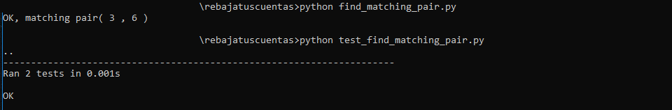

# Welcome to RebajaTusCuentas.com

Please complete this guide by uploading your work to your own gitlab repository 
and doing a MR to this one. The branch must contain the readme file with the
responses using markdown and referencing to folders or files
that you need in order to solve the test.

## 1

We encourage documentation and investigation in order to have agile development.
We support RTFM and LMGTFY:

>___Create a file telling us when you last used RTFM and LMGTFY,
the OS you use and the languages you master___

## reply

Doing LMGTFY and defining the concepts:

1.RTFM: Read the Fine Manual (Lee el buen manual)

2.LMGTFY: Let Me Google That For You (Déjame buscarlo en Google para ti)

Now my replies:
1. Las week, at least 1 time.

2. For this test.

3. OS (mainly WIN., later LINUX, the least used MAC)

4. Languages you master

4.1. Computer Languages: C++, Go, Python, Dart, Flutter, Flet, PowerBuilder, ..

4.2. Human Languages: Spanish, English, Italian, ..

## 2

Automation helps us to avoid human errors. Some of our systems use CI.

>___Write a program in the language of your choice that can accomplish this.
You can use Pseudocode.___
>___If you are not familiar with writing these programs, you can explain the
most representative concepts.___

## reply
Continuous Integration (CI) allows to automate the integration of code changes

1.code building 
https://github.com/DENRIV/docker_web_golang_nodejs_python_flask_django/tree/main/python

2.testing 
https://github.com/DENRIV/docker_web_golang_nodejs_python_flask_django/tree/main/python_unittest

etc.

## 3

A developer's portfolio is important to us. We ask you to upload 1 or 2 
projects of your authorship.

>___If you do not want to share the code, you can just paste some of it.___

## reply

1. In this classical program, It was added the full test-drf code.
https://github.com/DENRIV/test-drf-django-restful-framework-api

2. Working with Python Flask sqlalchemy PostgreSQL APIs & test with Thunder VSC.
https://github.com/DENRIV/Python_Flask_sqlalchemy_PostgreSQL_API_Thunder_VSC

## 4

>___Please, write a code or pseudocode that solves the problem in which I have a 
collection of numbers in ascending order. You need to find the matching pair 
that it is equal to a sum that its also given to you. If you make any 
assumption, let us know.___

>___Example:___
* [2,3,6,7]  sum = 9  - OK, matching pair (3,6)
* [1,3,3,7]  sum = 9  - No

* Consider recibe 1 000 000 numbers

## reply

<a href="find_matching_pair.py">find_matching_pair.py</a>

<a href="test_find_matching_pair.py">test_find_matching_pair.py</a>

## 5

"The message is in spanish."

>___4573746520657320656c20fa6c74696d6f207061736f2c20706f72206661766f722c20616772
6567616d6520616c2068616e676f75743a200d0a0d0a226d617274696e406d656e646f7a6164656c
736f6c61722e636f6d22207061726120736162657220717565206c6c656761737465206120657374
612070617274652e0d0a0d0a477261636961732c20792065737065726f20766572746520706f7220
617175ed212e___

>___U2kgbGxlZ2FzIGhhc3RhIGVzdGEgcGFydGUsIHBvciBmYXZvciwgY29tZW50YW1lbG8gY29uIHVu
IG1lbnNhamUu___

## reply

hex decoder & base64 decoder

Este es el último paso, por favor, agregame al hangout: 

"martin@mendozadelsolar.com" para saber que llegaste a esta parte.

Gracias, y espero verte por aquí!.

Si llegas hasta esta parte, por favor, comentamelo con un mensaje.

# All answers must be inside a docker image and the answer will be tested with a running container. Add lint and at least 01 unit test
docker build -t docker-image .

docker run --rm docker-image python find_matching_pair.py

docker run --rm docker-image python test_find_matching_pair.py

docker run --rm -v $PWD:/app docker-image pylint find_matching_pair.py
